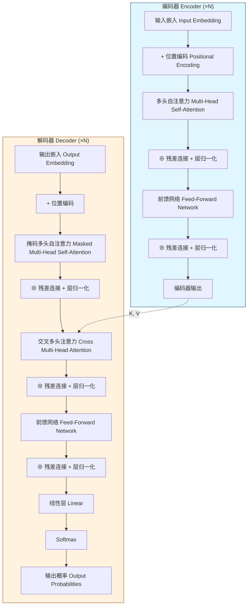
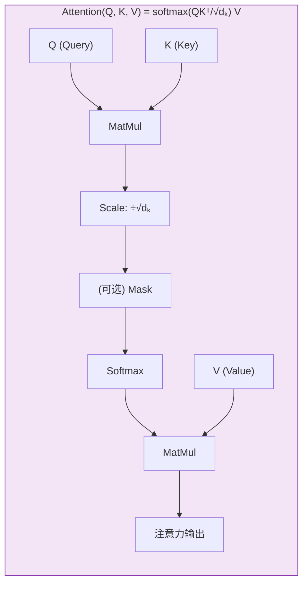
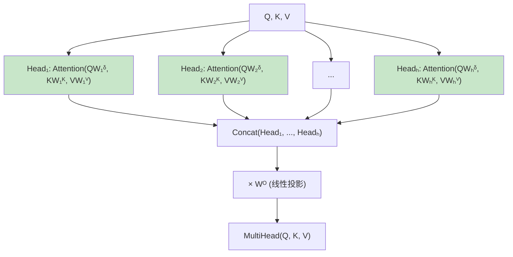
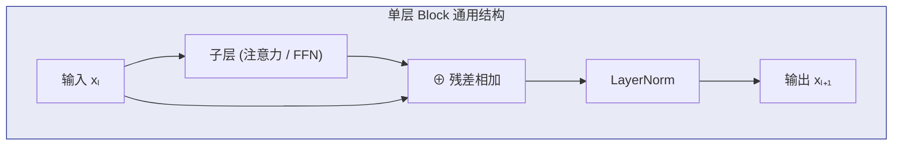
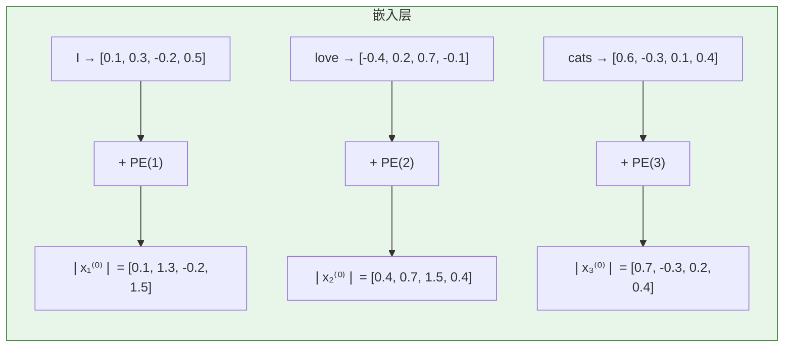
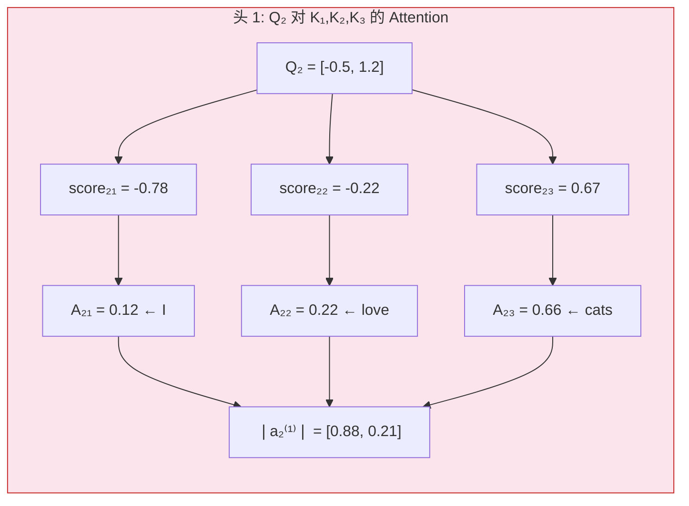
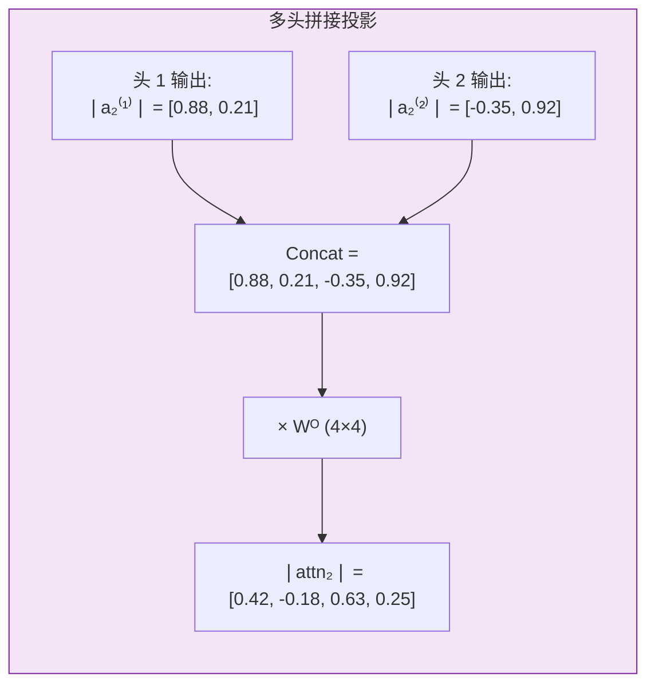
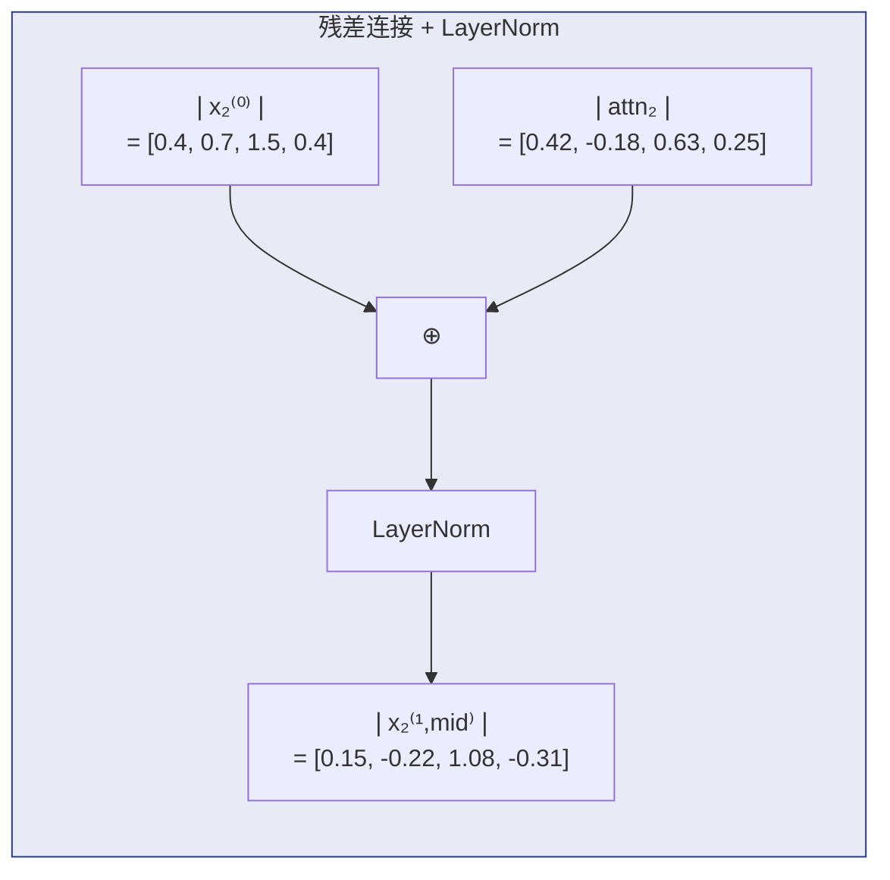
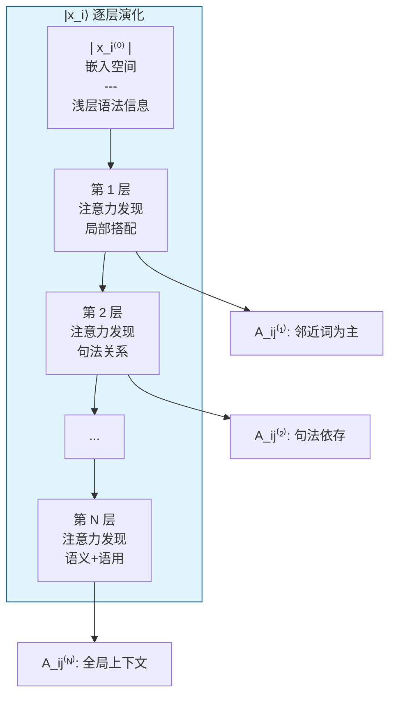
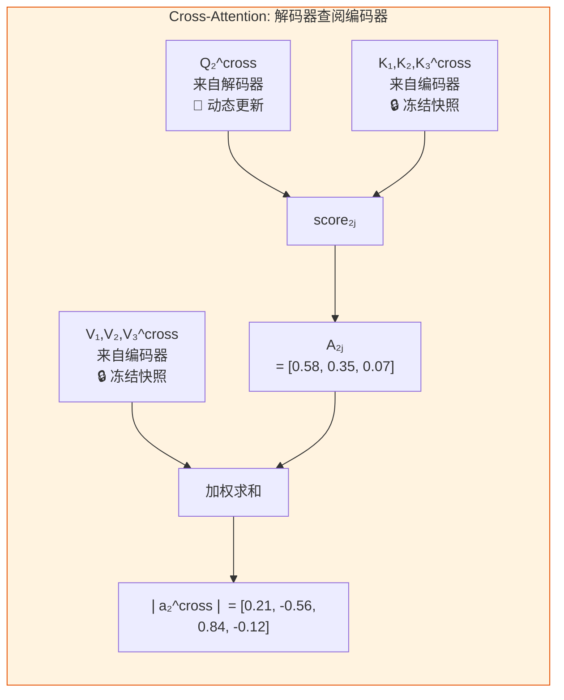

# Transformer 架构示意

> 基于 Vaswani et al. (2017) "Attention Is All You Need"

## 整体结构



## 缩放点积注意力 (Scaled Dot-Product Attention)



## 多头注意力 (Multi-Head Attention)



## 单层 Encoder / Decoder 详细展开



## 关键公式

| 组件 | 公式 | 维度 |
|------|------|------|
| Self-Attention | $\text{Attention}(Q,K,V) = \text{softmax}\!\left(\frac{QK^\top}{\sqrt{d_k}}\right) V$ | $Q \in \mathbb{R}^{n \times d_k}$ |
| Multi-Head | $\text{MultiHead}(Q,K,V) = \text{Concat}(\text{head}_1,\ldots,\text{head}_h)W^O$ | $\text{head}_i = \text{Attention}(QW_i^Q, KW_i^K, VW_i^V)$ |
| FFN | $\text{FFN}(x) = \text{ReLU}(xW_1 + b_1)W_2 + b_2$ | $W_1 \in \mathbb{R}^{d_{\text{model}} \times d_{ff}}$ |
| LayerNorm | $\text{LayerNorm}(x) = \gamma \cdot \frac{x - \mu}{\sigma} + \beta$ | 逐样本归一化 |
| Positional Encoding | $\text{PE}_{(pos, 2i)} = \sin(pos/10000^{2i/d})$ / $\cos$ | 绝对位置 |

## 维度参数典型值

| 参数 | 符号 | base | big |
|------|------|------|-----|
| 模型维度 | $d_{\text{model}}$ | 512 | 1024 |
| FFN 内层维度 | $d_{ff}$ | 2048 | 4096 |
| 注意力头数 | $h$ | 8 | 16 |
| 每头维度 | $d_k = d_v = d_{\text{model}}/h$ | 64 | 64 |
| 层数 | $N$ | 6 | 6 |

## 三种注意力模式

| 模式 | 位置 | Q 来源 | K, V 来源 | 特点 |
|------|------|--------|-----------|------|
| **Self-Attention** | Encoder | 当前层输入 | 当前层输入（同源） | 每词可见所有词 |
| **Masked Self-Attention** | Decoder 第一子层 | 当前层输入 | 当前层输入（同源） | 因果掩码，仅可见已生成词 |
| **Cross-Attention** | Decoder 第二子层 | Decoder 输出 | **Encoder 输出** | 解码器"查阅"编码器信息 |

---

# 完整前向传播：从 \(|x_i\rangle\) 到输出

> 用英语→法语翻译示例逐步骤追踪。输入句子 "I love cats"，输出句子 "j'aime les chats"。
> 为便于展示，维度取 d_model = 4，h = 2，d_k = d_v = 2，实际模型维度见此值 ×128。

## 示例设定

```
输入:  ["<sos>", "I",    "love", "cats", "<eos>"]
索引:  t=0       t=1      t=2      t=3      t=4
输出:  ["<sos>", "j'",   "aime", "les",   "chats", "<eos>"]
索引:  t=0       t=1      t=2      t=3      t=4      t=5
```

每一轮解码器推断输出一个 token（自回归），此处仅展示解码器生成 t=2（"aime"）时的完整计算。

---

## 第 0 步：嵌入 → \(|x_i^{(0)}\rangle\)

```
Token ID "I"     →  E[12]  = [0.1, 0.3, -0.2, 0.5]   (查嵌入表)
Token ID "love"  →  E[88]  = [-0.4, 0.2, 0.7, -0.1]
Token ID "cats"  →  E[203] = [0.6, -0.3, 0.1, 0.4]

加上位置编码 PE(pos)：

|x_1^(0)⟩ = 嵌入("I")    + PE(1)  = [0.1,  0.3,  -0.2, 0.5 ] + [0.0, 1.0, 0.0, 1.0] = [0.1,  1.3,  -0.2, 1.5]
|x_2^(0)⟩ = 嵌入("love") + PE(2)  = [-0.4, 0.2,  0.7,  -0.1] + [0.8, 0.5, 0.8, 0.5] = [0.4,  0.7,  1.5,  0.4]
|x_3^(0)⟩ = 嵌入("cats") + PE(3)  = [0.6,  -0.3, 0.1,  0.4 ] + [0.1, 0.0, 0.1, 0.0] = [0.7,  -0.3, 0.2,  0.4]
```



| 🔄 更新的 | 🔒 不变的 |
|-----------|-----------|
| \(|x_i^{(0)}\rangle\) 向量（从输入实时生成） | 嵌入矩阵 E（训练参数，推理时冻结） |
| | 位置编码 PE(pos)（正弦/余弦固定函数） |

---

## 第 1 层 Encoder（ℓ = 1）

### 3a. Self-Attention 子层

以 **h=2 头**为例，d_k = d_v = 2。参数矩阵 W^Q, W^K, W^V 在每个头内独立。

**头 1 计算**（W^Q₁, W^K₁, W^V₁ 均为 4×2 矩阵）：

```
对 token "love" (i=2)：

  Q₂ = x₂^(0) · Wᵟ₁ = [-0.5, 1.2]     (← 从 [0.4, 0.7, 1.5, 0.4] 线性变换而来)
  K₁ = x₁^(0) · Wᴷ₁ = [0.3,  -0.8]     (← 从 "I" 计算)
  K₂ = x₂^(0) · Wᴷ₁ = [1.1,  0.2]
  K₃ = x₃^(0) · Wᴷ₁ = [-0.7, 0.5]

  score₂ⱼ = Q₂ · Kⱼ / √2 :         ← 除以 √d_k 防止方差膨胀

    j=1 ("I"):    (-0.5×0.3  + 1.2×(-0.8)) / 1.414 = (-0.15 - 0.96)/1.414 = -0.78
    j=2 ("love"): (-0.5×1.1  + 1.2×0.2)    / 1.414 = (-0.55 + 0.24)/1.414 = -0.22
    j=3 ("cats"): (-0.5×(-0.7) + 1.2×0.5) / 1.414 = (0.35 + 0.60)/1.414  = 0.67

  A₂ⱼ = softmax([-0.78, -0.22, 0.67]) = [0.12, 0.22, 0.66]
                                           ↑"I"  ↑"love" ↑"cats"
  ← token "love" 最关注 "cats"（权重 0.66），其次自己（0.22），对 "I" 关注较少（0.12）

  V₁ = x₁^(0) · Wⱽ₁ = [-0.4, 1.0]
  V₂ = x₂^(0) · Wⱽ₁ = [0.6, -0.5]
  V₃ = x₃^(0) · Wⱽ₁ = [1.2, 0.3]

  |a₂^(1)⟩ = Σⱼ A₂ⱼ · Vⱼ
           = 0.12×[-0.4, 1.0] + 0.22×[0.6, -0.5] + 0.66×[1.2, 0.3]
           = [-0.048, 0.12] + [0.132, -0.11] + [0.792, 0.198]
           = [0.88, 0.21]
```



**头 2** 同理（用另一套 Wᵟ₂, Wᴷ₂, Wⱽ₂），算出 \(|a_2^{(2)}\rangle = [-0.35, 0.92]\)。

**拼接 + 投影**：

```
Concat(|a₂^(1)⟩, |a₂^(2)⟩) = [0.88, 0.21, -0.35, 0.92]

|attn₂⟩ = Concat × Wᴼ (4×4 矩阵) = [0.42, -0.18, 0.63, 0.25]
```



| 🔄 更新的 | 🔒 不变的 |
|-----------|-----------|
| Q, K, V 向量（从当前 \(|x_i^{(ℓ-1)}\rangle\) 实时投影） | 参数：W^Q_h, W^K_h, W^V_h, W^O |
| 注意力权重 A_ij（每个上下文不同，每层重算） | |
| \(|attn_i\rangle\)（聚合并投影的输出） | |

### 3b. 残差 + LayerNorm（注意力后）

```
|x₂^(ℓ, mid)⟩ = LayerNorm( |x₂^(0)⟩      +      |attn₂⟩                           )
                          ↑ 残差直通              ↑ ε-级修正（远小于主信号）

=x₂^(ℓ,mid) = LayerNorm( [0.4, 0.7, 1.5, 0.4] + [0.42, -0.18, 0.63, 0.25] )
            = LayerNorm( [0.82, 0.52, 2.13, 0.65] )
            = [0.15, -0.22, 1.08, -0.31]               ← 归一化后
```



| 🔄 更新的 | 🔒 不变的 |
|-----------|-----------|
| \(|x_i^{(ℓ,mid)}\rangle\) —— 被新值替换 | LayerNorm 的 γ, β（训练参数） |

> ⚠️ **关键洞察**：残差意味着 \(|x_i^{(ℓ-1)}\rangle\) 的**主体直通**到下一阶段，注意力只添加 ε-级修正。在范畴论中，这对应**余单子的 counit ε：F(x) → x**——当 ε→0 时残差桥接坍缩为恒等映射。

### 3c. FFN 子层

```
|ffn₂⟩ = ReLU( x₂^(ℓ,mid) · W₁(4×8) + b₁ ) · W₂(8×4) + b₂
       = ReLU( [0.15, -0.22, 1.08, -0.31] · W₁ + b₁ ) · W₂ + b₂
       = ReLU( [0.8, -0.5, 0.0, 1.3, -0.2, 0.6, -0.9, 1.1] ) · W₂ + b₂
       = [0.8, 0.0, 0.0, 1.3, 0.0, 0.6, 0.0, 1.1] · W₂ + b₂
       = [0.33, 0.15, -0.42, 0.61]
```

| 🔄 更新的 | 🔒 不变的 |
|-----------|-----------|
| \(|ffn_i\rangle\) —— 对中间表示的逐 token 非线性变换 | 参数 W₁, b₁, W₂, b₂（所有 token 共享同一套参数） |

### 3d. 残差 + LayerNorm（FFN 后）

```
|x₂^(1)⟩ = LayerNorm( [0.15, -0.22, 1.08, -0.31] + [0.33, 0.15, -0.42, 0.61] )
         = LayerNorm( [0.48, -0.07, 0.66, 0.30] )
         = [-0.10, -0.35, 0.22, -0.18]
```

| 🔄 更新的 | 🔒 不变的 |
|-----------|-----------|
| **\(|x_i^{(ℓ)}\rangle\)** —— 第 ℓ 层的最终输出 | LayerNorm 的 γ, β |

---

## 第 2…N 层 Encoder：重复上述过程

每层的 **参数不同**，但结构相同。关键变化是：

```
层 1 注意力权重 A_ij^(1):     "I" 关注自身较多（位置编码近）
层 2 注意力权重 A_ij^(2):     "love" 开始关注 "I"（动词-主语绑定）
层 3 注意力权重 A_ij^(3):     "cats" 关注 "love"（宾语-动词绑定）
...
层 N 注意力权重 A_ij^(N):     全局上下文已充分混合，权重趋于均匀
```



---

## 编码器输出：冻结快照

编码器末层输出的 \(\{|x_1^{(N)}\rangle, |x_2^{(N)}\rangle, |x_3^{(N)}\rangle\}\) 被**冻结**：

```
|x₁^(N)⟩ = [-0.52, 1.34, 0.18, -0.77]   ← "I" 的编码器表示
|x₂^(N)⟩ = [0.88, -0.42, 1.05, 0.31]    ← "love" 的编码器表示
|x₃^(N)⟩ = [-0.15, 0.76, -0.93, 1.12]   ← "cats" 的编码器表示
                                        ↑ 这些向量不再改变
```

它们将在解码器的 **Cross-Attention** 中作为 K、V 源被反复查阅。

| 🔄 更新的 | 🔒 不变的（从此冻结） |
|-----------|---------------------|
| —（编码器推理已完成） | 编码器输出 \(\{|x_i^{(N)}\rangle\}\) |
| | 解码器生成期间，这部分不再重算 |

---

## 解码器侧：生成 t=2（"aime"）

解码器已生成 `["<sos>", "j'"]`，现在预测第三个 token。

### 掩码自注意力

```
Q₂^dec 来源于解码器嵌入 "j'" + PE(2) → 投影
K₁^dec, K₂^dec 来源于 "<sos>", "j'" 的嵌入 + PE → 投影

因果掩码：A₂₃ 被强制为 0（"aime" 不能偷看自己后面的 token）
```

### Cross-Attention（核心区别）

```
Q₂^cross = 解码器当前向量 × W^Q_cross   ← 解码器侧，正在更新
K_j^cross = |x_j^(N)⟩_enc × W^K_cross  ← 编码器侧，已冻结！
V_j^cross = |x_j^(N)⟩_enc × W^V_cross  ← 编码器侧，已冻结！

score₂ⱼ = Q₂^cross · K_j^cross / √d_k

A₂ⱼ^cross = softmax([2.3, 1.8, 0.5]) = [0.58, 0.35, 0.07]
                     ↑"I"  ↑"love" ↑"cats"
                     ← "aime" 最关注源句的主语 "I"（权重 0.58），其次动词 0.35

|a₂^cross⟩ = 0.58·V₁ + 0.35·V₂ + 0.07·V₃ = [0.21, -0.56, 0.84, -0.12]
```



| 🔄 更新的 | 🔒 不变的 |
|-----------|-----------|
| Q 向量（解码器侧，实时投影） | K, V（编码器侧，冻结快照） |
| 注意力权重 A_ij（解码→编码） | Cross-Attention 参数 W^Q, W^K, W^V, W^O |

### 残差 + LN → FFN → 残差 + LN（同编码器）

### 末层输出 → 词汇表概率

```
|x₂^dec(N)⟩ = [0.76, -0.34, 1.12, -0.58]   ← 解码器末层

logits = |x₂^dec(N)⟩ · W_output(4×|V|)     ← 投影到词汇量大小
       = [..., 3.2, ..., 0.8, ..., 4.5, ...]  (|V| 维向量)

P(token | 前文) = softmax(logits)
                = [..., 0.003, ..., 0.001, ..., 0.015, ...]  ← 各项和为 1

argmax → "aime"  ← 概率最高
```

| 🔄 更新的 | 🔒 不变的 |
|-----------|-----------|
| 输出概率分布 P | 输出投影矩阵 W_output（训练参数） |

---

## 全程总结表

```
步骤 | 输入                  | 输出                  | 🔄 更新的              | 🔒 不变的
─────┼─────────────────────┼──────────────────────┼─────────────────────┼──────────────────
①Embed|  token ID (离散)     | |x_i^(0)⟩            | |x_i^(0)⟩            | E, PE
②Self-Attn| |x_i^(ℓ-1)⟩    | |attn_i⟩             | Q,K,V, A_ij, |attn_i⟩ | W^Q,W^K,W^V,W^O
③+Res+LN| ②输出 + ①输入     | |x_i^(ℓ,mid)⟩        | |x_i⟩ (被替换)         | γ, β
④FFN   | |x_i^(ℓ,mid)⟩      | |ffn_i⟩              | |ffn_i⟩               | W₁,b₁,W₂,b₂
⑤+Res+LN| ④输出 + ③输入     | |x_i^(ℓ)⟩            | |x_i⟩ (被替换)         | γ, β
─────┼─────────────────────┼──────────────────────┼─────────────────────┼──────────────────
Enc输出| 编码器末层           | {|x_i^(N)⟩} (冻结快照) | —                    | 🔒 从此冻结
─────┼─────────────────────┼──────────────────────┼─────────────────────┼──────────────────
⑥Masked| 解码器嵌入          | |attn_i^masked⟩      | Q,K,V, A_ij           | W^Q,W^K,W^V,W^O
⑦Cross| ⑥输出 + Enc输出     | |attn_i^cross⟩       | Q, A_ij               | 🔒 K,V (编码器)
⑧Output| 解码器末层          | P(token)            | 概率分布               | W_output
```

## 核心洞察

1. **残差流是信息高速公路** —— \(|x_i\rangle\) 从嵌入层直通到末层，注意力/FFN 只添加 ε-级微扰。范畴论中对应**余单子 counit ε: F(x) → x**——当 ε→0 时残差桥接坍缩为恒等映射。

2. **参数 vs 激活** —— \(W^Q, W^K, W^V, W^O, W_1, W_2\) 等参数在推理时**冻结**，是函子的固定映射；而 \(|x_i\rangle\) 和 \(A_{ij}\) 从输入实时**涌现**，是自然变换的动态实例。

3. **Encoder 输出是冻结快照** —— 编码完成后的 \(\{|x_i^{(N)}\rangle\}\) 构成固定语义空间，解码器通过 Cross-Attention 查阅它。对应**伴随函子对**的 unit/counit 交换。

4. **注意力权重完全不跨层共享** —— 每层独立计算 \(A_{ij}\)。这是**米田不对称性**的根源：每层对"谁关注谁"有完全自主的重新判断。

5. **注意力是唯一的跨 token 交互通道** —— FFN 逐 token 独立执行，不同 token 之间的信息交换**完全**依赖注意力。因此注意力的不对称性是整个 Transformer 表示能力的核心结构约束。

---

## 与范畴论分析的关联

本项目将 Transformer 纳入**范畴论框架**分析，核心对应关系：

| Transformer 组件 | 范畴论视角 | 关键概念 |
|-------------------|------------|----------|
| 残差连接 $x + F(x)$ | 余单子 (Comonad) 共伴结构 | $\varepsilon \to 0$ 坍缩 |
| Self-Attention | Yoneda 引理：对象由到自身的态射完全刻画 | Token 作为索引 |
| Multi-Head | 函子范畴中的 Day 卷积 | 不对称性条件 |
| 层叠 | 单子/余单子迭代 | 不动点语义簇 |
| Cross-Attention | 伴随函子对 (Adjunction) | Encoder ↔ Decoder |
