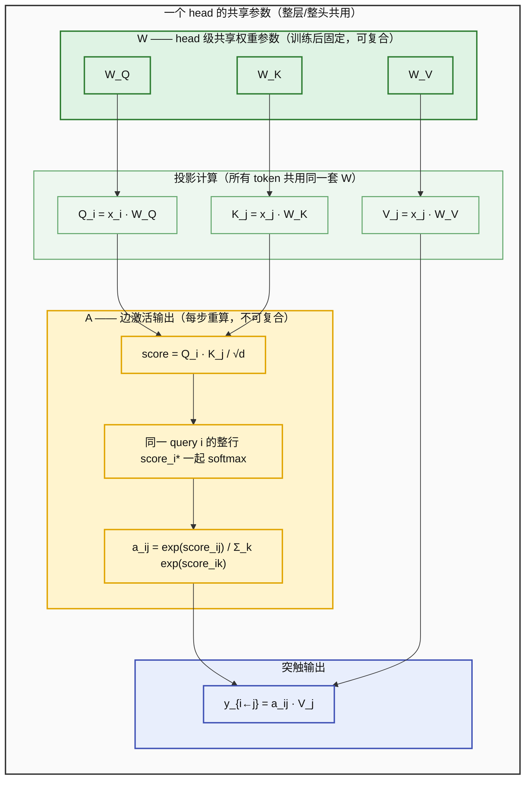
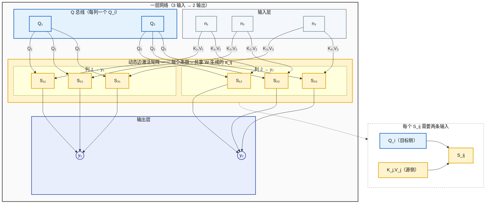
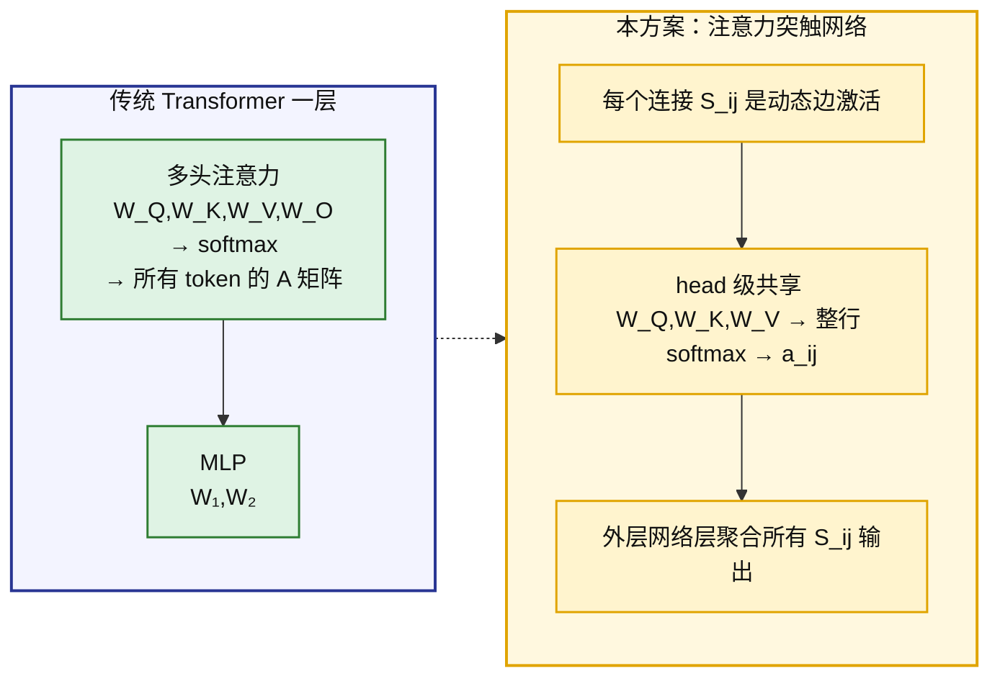
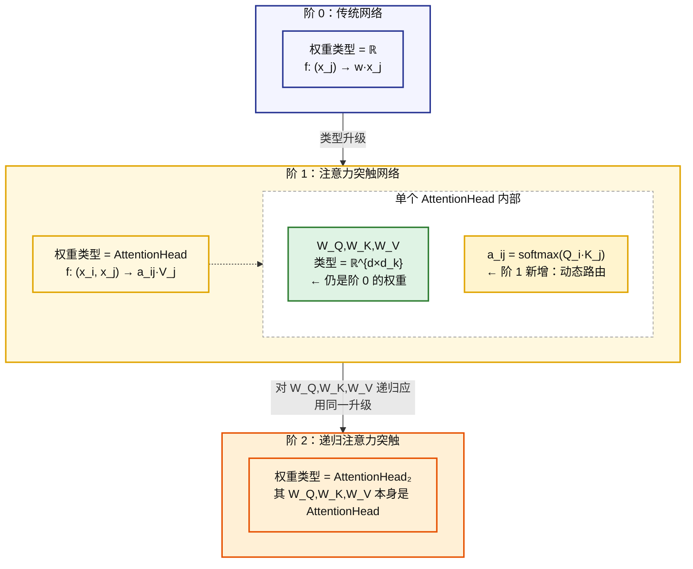
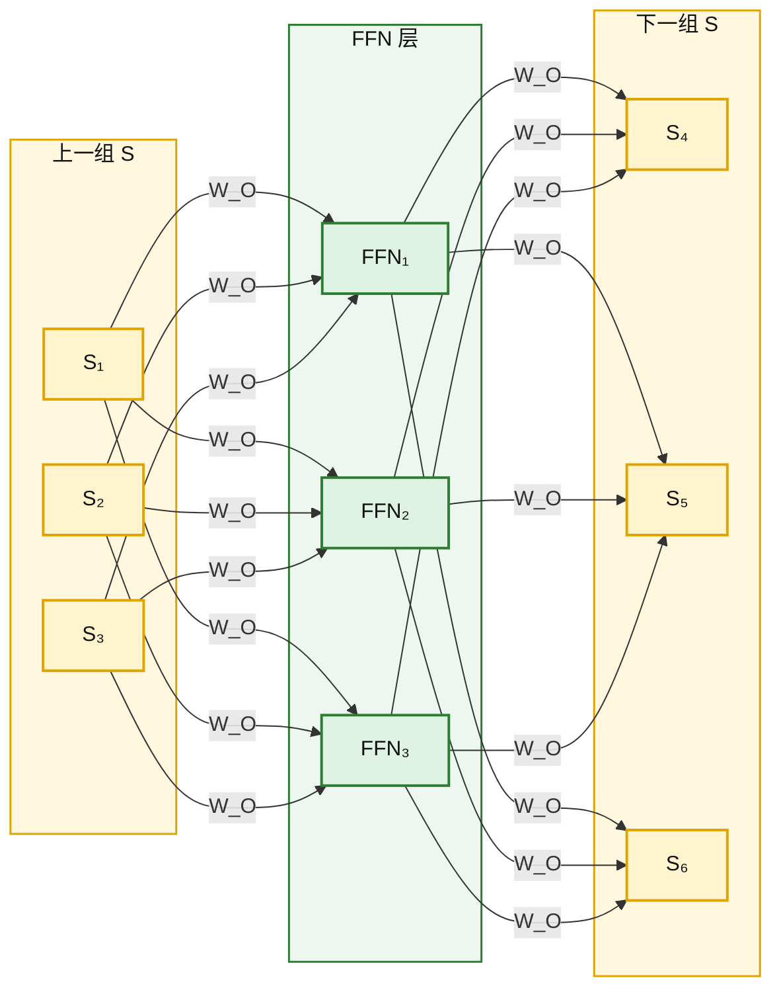

# 注意力突触：W 是权重，A 是权重的激活值

> 传统网络：权重类型 = ℝ。本方案：权重类型 = AttentionHead，内部含 W（推理时固定，含线性和非线性，参数可跨层追踪）和 A（推理时每步重算，纯标量输出，不可复合）。同一权重对不同的输入，其 A 输出 a_ij 不同。

---

## 一、W 与 A 的定义

**W**：推理时参数冻结的所有结构。包括 QKV 投影矩阵（线性）、MLP 权重矩阵及偏置（W₁,W₂,b₁,b₂，线性部分）、MLP 的 ReLU/GeLU 激活（非线性部分）、嵌入矩阵 E、输出投影 U。**W 包含非线性**——MLP 的激活函数在 W 内部引入非线性变换，所以 W 不是纯线性的。但 W 的参数在推理时不变，这是区分于 A 的判据。

**A**：前向传播中每步重算的注意力分数 a_ij = softmax(Q_i·K_j/√d)_j。按命题 1，A 不满足 CK 方程，跨层乘积 A^{(l+1)}·A^{(l)} 不等于实际的两步路由。**A 是纯标的**：softmax 输出，无内部非线性结构。

**切分判据**：变化性。W 推理时不变（参数冻结），A 每层重算（依赖当前输入）。W 内部的非线性（ReLU/GeLU）在推理时也不变——激活函数本身是固定的无参运算。

---

## 二、为什么权重是 W，不是 A

```
A 承担"权重"角色会产生的矛盾：

  A 不可跨层复合（命题 1）
    → 若 A 是权重，权重不可复合
    → 若全正，A^L 收敛到秩一矩阵（命题 2）
    → 路由退化，表示同质化
    → 深度网络不可能

W 承担"权重"角色：

  W 可跨层复合 ✓（命题 3）
  → 语义变换可逐层累积
  → 深度有意义
```

**结论**：A 在结构上不能满足"权重"角色的复合要求。W 可以。因此权重是 W。A 是权重在当前输入下的激活输出——可以类比为神经元的激活值不是该神经元的权重。

---

## 三、一条注意力边的内部（标准 Transformer）



| | W（权重） | A（权重的激活） |
|---|---|---|
| **具体内容** | head 级共享的 W_Q, W_K, W_V（参数矩阵） | a_ij（某条 token 边的标量激活） |
| **变化性** | 推理时不变，且对所有 token pair 共享 | 每次前向重算，随输入和当前位置变化 |
| **可复合性** | ✓ W_Q,W_K,W_V 是线性投影，可跨层矩阵乘法复合 | ✗ 不满足 CK 方程 |
| **功能** | 编码"如何匹配"的语义知识 | 输出当前输入下的连接强度 |

一条边激活 S_ij 的计算是：**head 级共享的固定参数 W 执行投影 → 对同一 query 的所有 key 分数做整行 softmax → 得到动态激活 A（a_ij）→ 加权 V_j 输出**。W 决定"这个 head 如何做匹配"，A 是"对当前输入，这条 token 边的具体连接强度"。

---

## 四、一层网络：权重 = 注意力突触阵列



**每个 S_ij 有两条输入**：
- 行方向（K/V 总线）：n_j → S_{j,*}，源神经元 j 把自己的 K_j,V_j 广播到该行
- 列方向（Q 总线）：Q_i → S_{*,i}，目标侧的 Q_i 沿列广播到该列所有 S

**Q_i 的来源是未决设计选择**：
- 方案 A：Q_i = x_i · W_Q，用输入侧对应位置的表示（输入维度 = 输出维度时适用）
- 方案 B：Q_i 是每输出神经元的可学习参数（输入维度 ≠ 输出维度时通用）
- 方案 C：Q_i 由上一层的输出聚合得到（与残差流耦合）

图上用 Q 总线抽象 Q_i 来源——选哪个方案不影响核心结构：**每个 S_ij 承载的是共享 head 在当前输入下生成的一条边激活，输出 a_ij·V_j 累加到 y_i；a_ij 来自同一 query 行的整体 softmax，不是单条边独立归一化。**

---

## 五、与传统 Transformer 的差异



| | 传统 Transformer | 注意力突触网络 |
|---|---|---|
| **权重的粒度** | 整个序列共享 QKV 投影矩阵 | 每个 head 共享一套 QKV；S_ij 不拥有独立 QKV |
| **A 的计算范围** | 整个序列的 n×n 注意力矩阵 | 单条连接取其中一个标量 a_ij，但 softmax 由整行 score_i* 决定 |
| **W/A 空间关系** | 同一层内顺序交错 | 每个突触内部 W→A 嵌套 |
| **权重的类型** | 矩阵（ℝ^{d×d}） | AttentionHead（函数） |

---

## 六、类型升阶：ℝ → AttentionHead



**阶 0**：权重是标量，输出是 w·x_j。没有 W/A 区分——权重不存在"激活"的概念。

**阶 1**：权重是 AttentionHead，输出是 a_ij·V_j。AttentionHead 内部有 W/A 区分：W_Q,W_K,W_V 是阶 0 的权重（固定参数，线性），a_ij 是阶 1 新增的激活输出（动态、不可复合）。

**阶 2**：递归应用同一条升级规则——将阶 1 中阶 0 的部分（W_Q,W_K,W_V）也替换为 AttentionHead。

**W 包含非线性**：阶 0 的 W 不是纯线性。MLP 内有 ReLU/GeLU，使 W 的前向计算本身是非线性变换。W_Q,W_K,W_V 是线性的，但完整的 W（含 MLP）不是。因此 W 的"可复合性"不能简单表述为矩阵乘法封闭——它是在残差流框架下，参数可被追踪并跨层累积。这一点在阶 1 依然成立：AttentionHead 内部的 W_Q,W_K,W_V 是线性的，但外层网络（组织这些突触的结构）包含非线性。

**W/A 自相似**：在阶 k，W = 阶 k-1 的完整权重结构（含非线性），A = 阶 k 新增的动态激活（纯标的，softmax 输出）。同一条 W→A 嵌套关系在每一阶复现。阶数增长来自对 W 中**线性部分**（W_Q,W_K,W_V）重复应用"ℝ → AttentionHead"的类型升级，而非线性部分随阶 k 的 W 整体继承。

---

## 七、总结

| | 传统网络 | 注意力突触网络 |
|---|---|---|
| **权重类型** | ℝ | AttentionHead（内部：W_Q,W_K,W_V + 前向产生 a_ij） |
| **权重输出** | w_ij·x_j | a_ij·V_j（依赖当前输入） |
| **W 在哪** | 无此概念 | 每条连接的固定参数 W_Q,W_K,W_V |
| **A 在哪** | 无此概念 | 每条连接前向时动态计算的 a_ij |
| **W/A 结构** | 不存在 | 每个突触内部嵌套 |
| **深度来源** | 层数 L | 层数 L × 阶数 K（每阶内 W 参数可跨层追踪累积，阶间对 W 的线性部分做类型升阶） |

---

## 八、S → FFN 双层堆叠



---

## 九、什么是必然的，什么不是

这里必须分三层：**WA 框架本身**、**标准 Transformer 的实现选择**、**注意力突触网络的新架构设想**。混在一起会把工程选择误写成数学必然。

---

### A. WA 框架的必然约束

| # | 约束 | 为什么是必然 |
|---|------|-------------|
| 1 | **区分 W 与 A** | W 是推理时固定、可跨层追踪的参数/变换结构；A 是当前输入下动态生成的路由激活。没有这个切分，就不是 WA 框架。 |
| 2 | **A 必须依赖当前状态** | 如果 A 不依赖当前 residual state，而是固定路由，就退化为静态混合，无法表达逐层重新选路。 |
| 3 | **a_ij 不是独立权重** | 在标准 Transformer 中，a_ij 是共享 Q/K 规则在当前输入上的输出，不是每条边自己的 learned parameter。 |
| 4 | **softmax 是行级竞争** | a_ij 由同一 query i 对所有 key 的分数一起归一化得到，不是单条边局部归一化。 |
| 5 | **W 的线性参数路径可复合/可追踪** | 例如 W_O^l · W_Q^m 这类虚拟权重可以作为跨层参数路径分析对象。非线性会打断矩阵折叠，但不打断参数路径追踪。 |
| 6 | **需要某种信息保持通道** | 若要深层语义累积，必须有 residual / additive state / memory carrier 一类保存早期信息的结构；具体形式不必然。 |

---

### B. 标准 Transformer 的实现选择

| 结构 | 判断 | 说明 |
|------|------|------|
| 多头并行 | 常见且重要，但不属 WA 必然 | 多头提供多组共享路由核；头数、维度、是否 GQA/MQA/MLA 都是实现选择。 |
| Q/K/V 来自同一 residual stream | self-attention 中通常成立 | cross-attention、多模态 attention 中 Q 与 K/V 可来自不同源。 |
| Q 和 K 使用不同投影 | 常见增强表达力 | 不是必然。即使 Q=K，row-softmax、causal mask、位置结构也可产生非对称 A。 |
| head 输出 concat 后过 W_O | 标准实现 | concat 不意味着 WA 失效；它只是把多个 head 的输出重新混合。 |
| Attention 与 FFN 串联成 block | 标准实现 | 可改为 parallel block、attention-only、MoE-FFN 等形式。 |
| FFN position-wise 共享 | 标准实现 | 不是“每个 head/列独占 FFN”。 |

---

### C. 注意力突触网络的设计约束

以下约束只在采用“注意力突触网络”这个新架构设想时成立，不能反推为标准 Transformer 的必然。

| 约束 | 性质 | 说明 |
|------|------|------|
| 列作为持久实体 | 新架构定义内约束 | 如果把“列”定义成权重轨道，列就需要跨层保持身份。 |
| N 列并行 | 新架构的宽度设计 | N 是并行实体数，可类比 width，但不是 Transformer head 的必然解释。 |
| 列不合并或弱合并 | 设计偏好 | 若强 concat，列身份会被混合；但这只是新架构为了保持列身份的选择。 |
| 每列独占 FFN | 设计选择 | 可以增强列的独立轨道，但不是 WA 必然，也不是标准 Transformer。 |
| W_O 列间连接 | 设计选择 | 可用 dense、sparse、block-diagonal、low-rank、gated 等形式。 |
| W 沿列可追踪 | 新架构目标 | 若列是持久实体，就应保证固定参数路径能沿列追踪。 |

---

### D. 不必然但可调的工程选择

| 位置 | 选项 |
|------|------|
| S 内部匹配函数 | 点积 / MLP([Q,K]) / 双线性形式 / 其他匹配函数 |
| 归一化或门控 | softmax / sigmoid / sparsemax / ReLU 门控 / top-k |
| V 的设计 | V 独立于 K / K=V / 共享部分投影 |
| 投影形式 | 线性 / 低秩 / 非线性投影 |
| FFN | SwiGLU / ReLU / GELU / 更深子网络 / MoE |
| 层间结构 | 残差、门控残差、PreNorm/PostNorm/RMSNorm、稀疏连接 |
| 规模 | N 逐层可变、d_head 逐列可变、KV group 可变 |

---

### 简洁判据

判断一条结构是不是“必然”，只问一句：

> 去掉它之后，WA 的核心切分（固定 W + 动态 A + 可追踪信息载体）是否还存在？

若还存在，它就不是 WA 必然；最多是标准实现、工程选择，或注意力突触新架构的局部约束。

---
