# 主流架构的 W/A 统一分析

> 用 W/A 框架拆解从 MLP 到多模态的所有主要架构。同一模板，同一套问题，同一张演化树。

---

## 口径说明

这篇不是普通文献综述，而是用 W/A 框架重读架构。为了不把推演写成事实，下面统一分三层：

| 层级 | 含义 | 写法 |
|---|---|---|
| **原文事实** | 论文、技术报告或官方模型卡明确写出的结构 | 可以直接下结论 |
| **W/A 解释** | 用本框架对原文结构的重新描述 | 写成「可解释为」「可视为」 |
| **猜想 / 待验证** | 原文没公开，但可作为研究假说 | 单独标注，不进入主结论 |

---

## 分析模板

每个架构回答五个问题：

| | 问题 |
|---|---|
| **W** | 有哪些固定参数？可复合吗？ |
| **A** | 有内容相关的动态路由吗？如果有，在哪？什么形态？ |
| **列数** | 几个并行处理通道？持久还是临时？ |
| **路由方式** | 信息从哪到哪？谁决定的？ |
| **位在演化树上** | 和前后架构比，多了什么、少了什么 |

---

## 一、MLP（多层感知机）

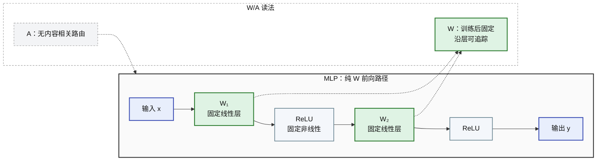

| | MLP |
|---|---|
| **W** | W₁...W_L。线性层 + 固定非线性，沿层可追踪 ✓ |
| **A** | **无。** 层间全连接固定——w_ij 训练后不变，与输入内容无关 |
| **列数** | 1（每层一个向量，维度混合） |
| **路由** | 固定全连接。每条边 w_ij 不随输入变化。「狗咬人」和「人咬狗」走完全相同的路径 |
| **演化位** | 纯 W 的起点 |

---

## 二、CNN（卷积神经网络）

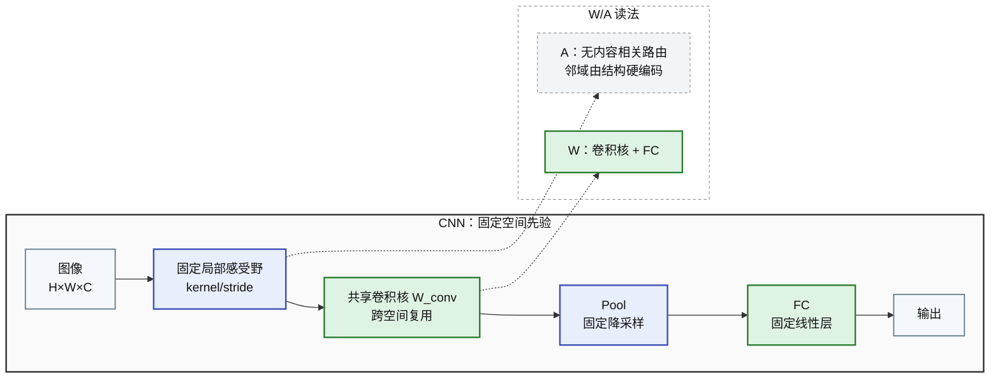

| | CNN |
|---|---|
| **W** | 卷积核（共享权重）+ FC 层。卷积核跨空间复用 ✓ |
| **A** | **无。** 感受野由 kernel_size 和 stride 硬编码——像素永远只看邻居，不管邻居是什么 |
| **列数** | C 个通道。但**非持久**——下一层通道数可任意变，1×1 卷积重分配 |
| **路由** | 固定空间局部连接。平移等变性硬编码在卷积操作里 |
| **演化位** | 纯 W + 空间先验。通道是最接近「列」的概念，但列不持久 |

---

## 三、RNN

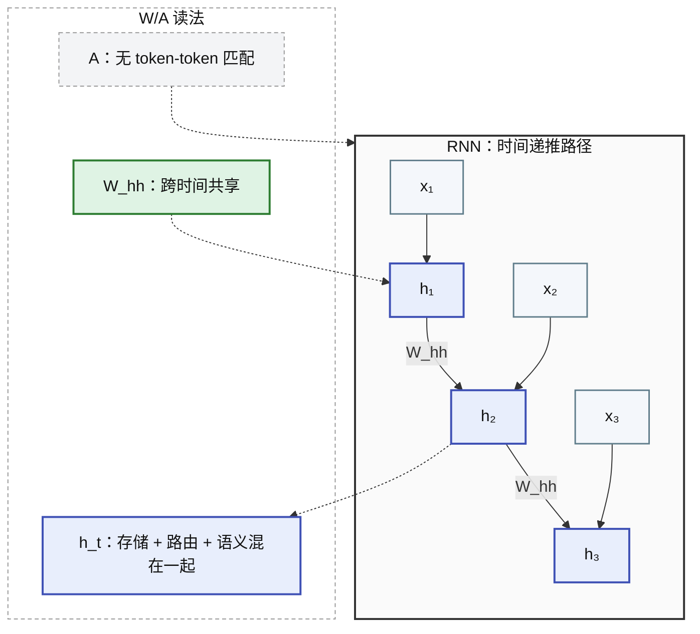

| | RNN |
|---|---|
| **W** | W_hh, W_xh, W_hy。沿时间步可追踪 ✓ |
| **A** | **无。** 时间步间连接由 W_hh 完全固定——h_{t-1}→h_t 的变换不随内容变化 |
| **列数** | 1。h_t 一个向量同时当路由器、存储器、语义载体 |
| **路由** | 固定时间连接。长程依赖 = W_hh 的谱性质，不是内容匹配 |
| **演化位** | 纯 W + 时序。隐藏状态的角色混淆是根本瓶颈 |

---

## 四、LSTM / GRU

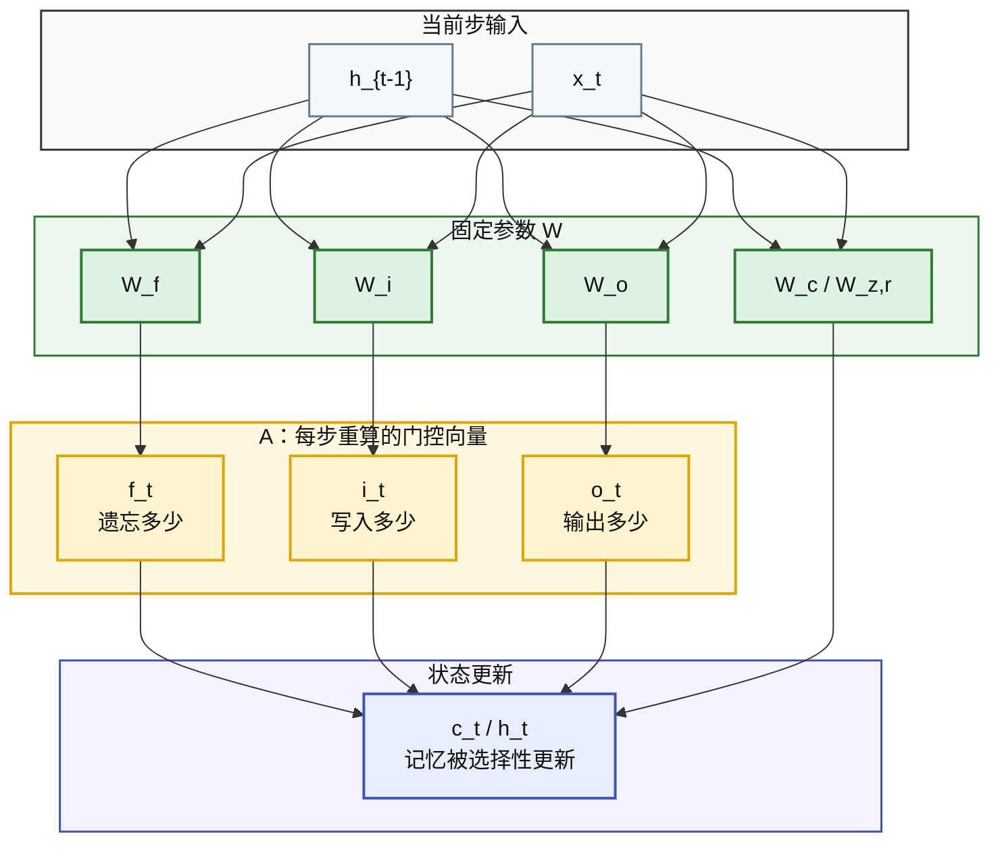

| | LSTM / GRU |
|---|---|
| **W** | W_f, W_i, W_o, W_c。沿时间步可复合 ✓ |
| **A** | **有！原始形态。** f_t, i_t, o_t = sigmoid(W·[h_{t-1},x_t])——内容相关，每步重算 |
| **列数** | 1 |
| **路由** | 门控做路由：f_t = 「丢多少」，i_t = 「写多少」，o_t = 「曝多少」。它们通常是按维门控向量，不是几枚标量 |
| **演化位** | **A 的早期形态。** 维度很低，但提示「内容相关门控」比纯固定递推更有表达力 |

---

## 五、Bahdanau Attention（Seq2Seq + Attention）

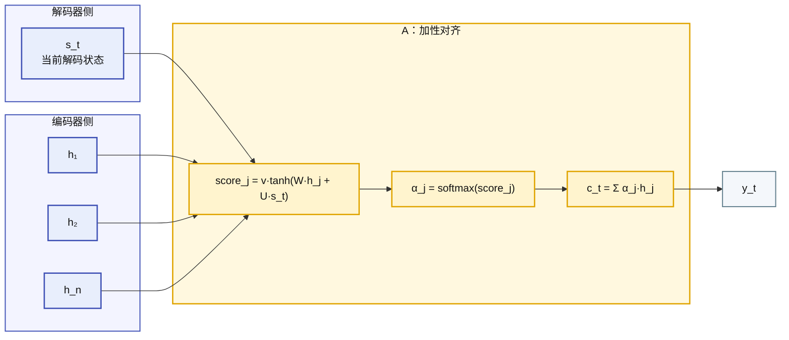

| | Bahdanau Attention |
|---|---|
| **W** | RNN 编码/解码权重 + W, U, v（注意力参数） |
| **A** | **有！完整形态。** Additive Attention——解码器和编码器做匹配，内容相关 |
| **列数** | 1（解码器仍是 RNN） |
| **路由** | Q（解码器状态）→ K（编码器状态）匹配 → softmax → 加权 V |
| **演化位** | **A 的诞生。** Q·K·V 雏形出现。但被包在 RNN 内部，A 没有独立层 |

---

## 六、Transformer（标准）

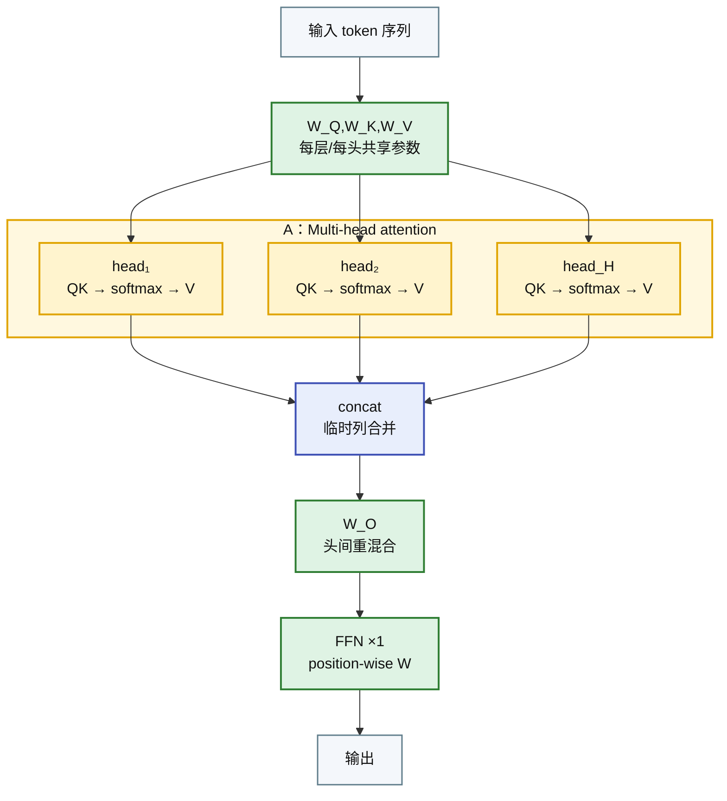

| | Transformer |
|---|---|
| **W** | W_Q,W_K,W_V,W_O + FFN（每层一套）。沿层可复合 ✓ |
| **A** | **有！完整形态。** Q·K 点积 → softmax → 加权 V。d_k 维匹配空间，n×n 路由矩阵 |
| **列数** | H 头。但**每层临时切**——concat+W_O 后重分，列不持久 |
| **路由** | Q·K 点积。W 存语义，A 做路由。A 可复合 ✗（命题 1），深度源自 A 每层重算 |
| **演化位** | A 的完整化 + 多列 + 残差流。列不持久是残留缺陷 |

---

## 七、Mamba / S4（状态空间模型）

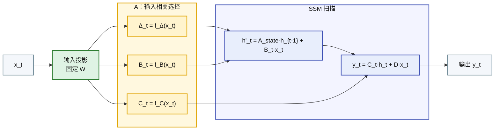

| | Mamba (S6) |
|---|---|
| **W** | SSM 参数、输入/输出投影、生成 Δ/B/C 的投影参数。注意：论文里的状态矩阵 A 属于 SSM 记号，不等于本文的动态路由 A |
| **A** | **有选择性动态门控。** Δ_t、B_t、C_t 由输入产生，每步重算；但它不是离散 token-token 的 Q·K softmax 路由 |
| **列数** | 1 |
| **路由** | B_t ≈ 「当前输入怎么写入状态」，C_t ≈ 「当前状态怎么读出」。它是序列扫描里的选择性读写，不是全局 pairwise 匹配 |
| **演化位** | 换了动态机制的形态：用选择性状态更新换取 O(n) 推理/训练效率 |

**W/A 解释**：Mamba 可以被放进 W/A 框架，但不要说成「Transformer 的 N=1 退化」。更稳的说法是：它保留了「固定参数生成动态计算路径」这一点，但动态性发生在状态更新里，而不是注意力矩阵里。

---

## 八、LLaVA 家族（Projector 桥接）

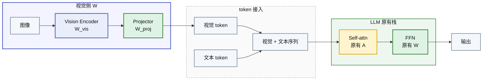

| | LLaVA |
|---|---|
| **W** | 预训练 Vision Encoder + Projector + LLM W。视觉特征先被投影到语言模型 embedding 空间 |
| **A** | **无新增跨模态 A。** 视觉 token 接入 LLM 后，由 LLM 原有 self-attn 机制处理 |
| **列数** | LLM 的 H 头（临时列）。视觉 token 就只是新来的 token |
| **跨模态路由** | 无独立机制。视觉 token 能否被文本 attend 到，由同一个 Q·K 决定 |
| **洞察** | LLaVA 说明：把视觉 token 接进 LLM self-attn 已经能工作。但这不是证明「不需要模态特定处理」；Vision Encoder 和 Projector 本身就是模态适配 |

---

## 九、Flamingo（Cross-Attention 注入）

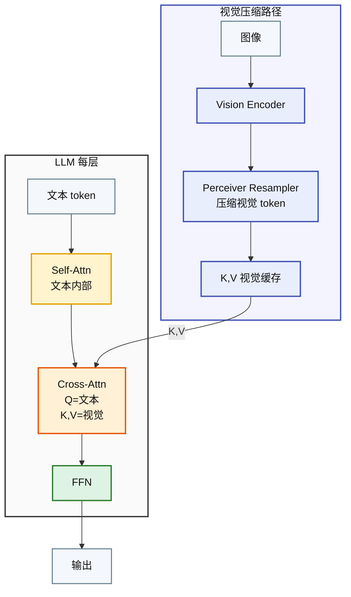

| | Flamingo |
|---|---|
| **W** | Vision Encoder + Perceiver + Cross-Attn K,V 投影（每层独立） |
| **A** | **双层 A**：Self-Attn（文本内部）+ Cross-Attn（文本→视觉）。跨模态有专属 A |
| **跨模态路由** | 独立。Q 文本 → K,V 视觉，不和 self-Attn 共享矩阵 |
| **代价** | Perceiver 压缩视觉信息 → 失去了视觉 token 之间的细粒度路由 |
| **洞察** | 「独立跨模态 A + 压缩 K,V」是这模式的核心取舍 |

---

## 十、CogVLM（Visual Expert 并行）

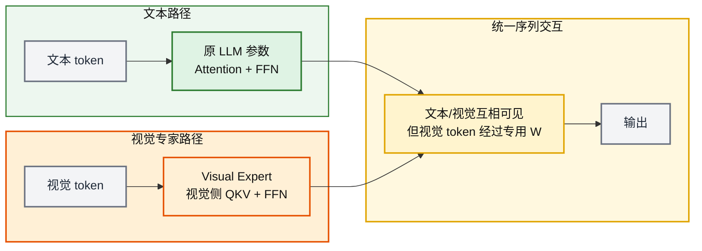

| | CogVLM |
|---|---|
| **W** | **模态专家分叉。** CogVLM 在每层加入 Visual Expert，不只是 FFN，也包括视觉侧 attention 投影 |
| **A** | 文本和视觉仍在统一序列里交互，但不能简单写成「A 完全共享」。视觉 token 的 QKV 经过视觉专家参数 |
| **跨模态路由** | 可解释为「共享序列交互 + 视觉侧专用 W」。它支持 W/A 框架，但不是「A 共享、W 分叉」的纯例子 |
| **洞察** | 更稳的说法：CogVLM 说明多模态里只靠 projector 不一定够，层内视觉专家能显著增强视觉 token 的表达和交互 |

---

## 十一、GPT-4o / Gemini（公开信息层面）

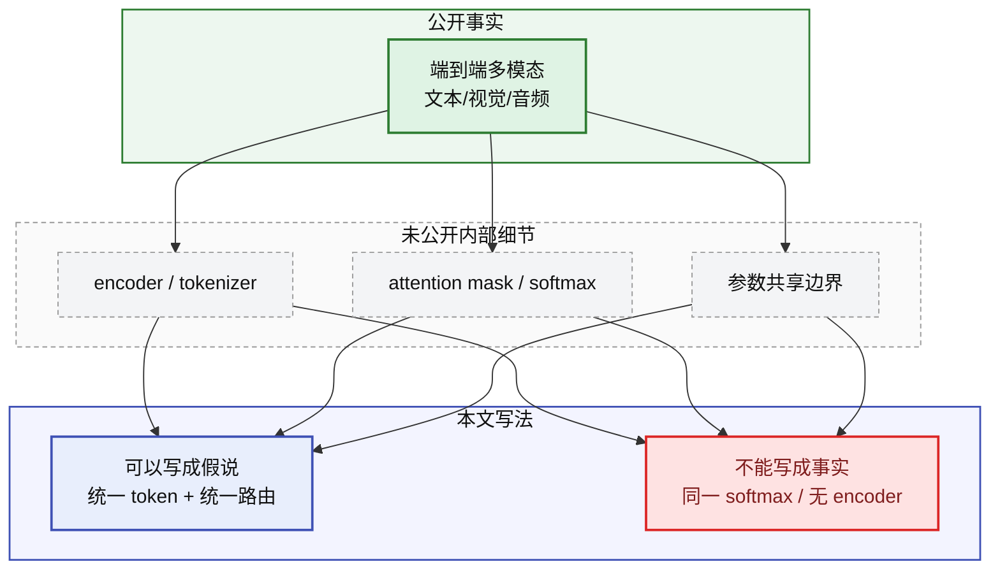

| | GPT-4o / Gemini |
|---|---|
| **原文事实** | GPT-4o 官方说它是端到端处理文本、视觉、音频的单一新模型；Gemini 技术报告说模型原生多模态 |
| **不可断言** | 不能断言「所有模态共享同一套 Transformer 参数」「没有独立 Vision Encoder」「所有 token 在同一个 softmax 矩阵里」 |
| **W/A 解释** | 可以把它们作为「更原生的多模态统一」方向来讨论，但内部 W/A 边界未公开 |
| **写法建议** | 放在「猜想 / 待验证」层，不进入统一对比表的硬事实列 |

---

## 统一对比表

| | W | A | 列数 | 列持久 | A 形态 |
|---|---|---|---|---|---|
| **MLP** | ✓ | ✗ | 1 | — | — |
| **CNN** | ✓ | ✗ | C | ✗（1×1 混合） | — |
| **RNN** | ✓ | ✗ | 1 | — | — |
| **LSTM/GRU** | ✓ | ✓ 原始 | 1 | — | 门控 sigmoid |
| **Bahdanau** | ✓ | ✓ | 1 | — | Additive MLP |
| **Transformer** | ✓ | ✓ | H | ✗（concat 重分） | Q·K 点积 |
| **Mamba/S6** | ✓ | ✓ 选择性 | 1 | — | Δ/B/C 输入相关 |
| **LLaVA** | ✓ + W_vis | ✓ | H | ✗ | Q·K 点积 |
| **Flamingo** | ✓ + W_cross | ✓ + **A_cross** | H | ✗ | Self-A + Cross-A |
| **CogVLM** | ✓ + **Visual Expert** | ✓ | H | ✗ | 视觉侧 QKV/FFN 专家 |
| **GPT-4o/Gemini** | 未公开足够细节 | 未公开足够细节 | — | — | 只可作猜想 |
| **本架构** | ✓ + 列独立 | ✓ | N | **✓** | Q·K 点积（可选） |

---

## 演化树

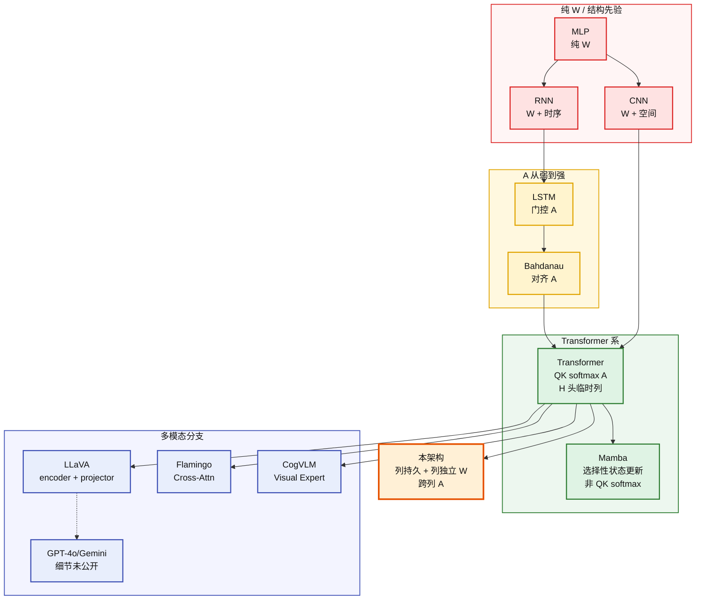

---

## 三条演化线索

**线索一：A 从无到有、从弱到强**

```
无 A（MLP/CNN/RNN）→ 原始 A（LSTM 门控，3-4 标量）
→ 完整 A（Bahdanau，MLP 匹配）
→ 高效 A（Transformer，Q·K 点积）
→ 选择性动态机制（Mamba，Δ/B/C 输入相关）
→ 双层 A（Flamingo，Self-A + Cross-A）
```

**线索二：列从无到多、从临时到持久**

```
1 列（MLP/RNN/LSTM）→ C 通道非持久（CNN）
→ H 头临时（Transformer/LLaVA 等公开 Transformer 系）
→ N 列持久（本架构）
```

**线索三：W 从共享到分叉**

```
统一 W（MLP/RNN/Transformer）
→ 模态/专家分叉 W（CogVLM Visual Expert, Flamingo Cross-Attn）
→ 列独立 W（本架构）
```

---

## 核心洞察

**1. 很多重大进步，都在增加内容相关的动态计算。** 门控、对齐权重、多头注意力、选择性状态更新，都让模型不再只靠固定 W 走同一条路。但这不是唯一进步来源，规模、数据、优化和位置编码同样重要。

**2. 多模态是一个放大镜，把 W/A 边界暴露得更清楚。** LLaVA 说明「projector + LLM self-attn」能工作；Flamingo 说明独立 cross-attn 有价值；CogVLM 说明层内视觉专家也有价值。它们支持 W/A 框架，但不是简单证明「A 管路由，W 管语义」。

**3. 列持久化仍是待验证方向。** 多头 attention、MoE、视觉专家、多分支视频模型都提供了旁证，但还不能直接证明「持久功能列」一定成立。

**4. 本架构在演化树上不是替代某一条线，而是补上「列持久 + W/A 结构分离」这块缺失的拼图。**

---

## 附录：视频生成模型的 W/A 分析

> 视频多了一个时间维。W/A 框架帮你看清楚：时间是怎么被处理的——是 A 的事、W 的事、还是额外的结构？

---

### 一、Sora / DiT 家族（Spacetime Patches）

**代表**：Sora (OpenAI)、HunyuanVideo (腾讯)、Stable Video Diffusion

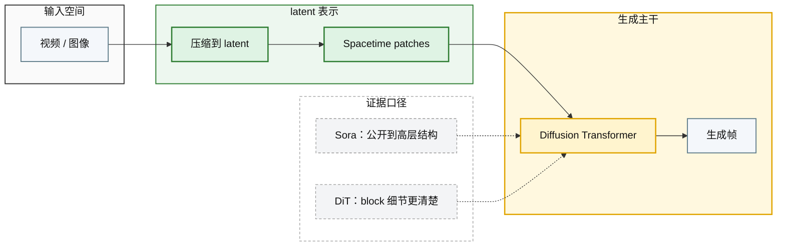

| | Sora / DiT |
|---|---|
| **W** | DiT 原文里是 latent patch embedding + Transformer block + diffusion 相关条件层。Sora 公开资料只确认 latent/spacetime patches + diffusion transformer 的高层方向 |
| **A** | 对 DiT/很多视频 DiT，可以说 patch token 通过 transformer attention 交互；对 Sora 不能断言具体 attention mask、head 设计或是否「一个 A 覆盖所有 token」 |
| **列数** | H 头（临时列） |
| **时间路由** | 更稳的说法：时间被 token 化后进入 transformer 处理。是否有专门时间结构，要看具体模型公开细节 |
| **洞察** | Sora 支持「spacetime patch + transformer」路线很强；但不能反推「纯统一 A 就足够解释全部时空能力」 |

**W/A 诊断**：把视频改写成 patch 序列后，Transformer 的 A 可以参与时空交互。但这里应该写成「可参与」，不是「唯一在做所有路由」。

---

### 二、CogVideoX（3D VAE + Expert Transformer）

**代表**：CogVideoX (智谱)

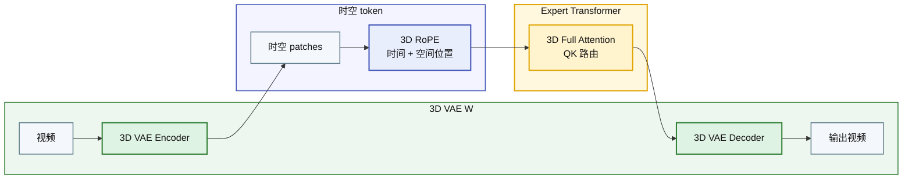

| | CogVideoX |
|---|---|
| **W** | 3D VAE + Expert Transformer W（和 DiT 同结构）。3D RoPE 给位置编码加上了时间维 |
| **A** | 公开论文支持 3D full attention / expert transformer 的说法。不要写「和 Sora 相同」，因为 Sora 细节未公开 |
| **时间路由** | 3D RoPE 把时间维纳入位置编码，使 attention 在 Q·K 空间里带有时空位置信息 |
| **洞察** | CogVideoX 是更适合做结构分析的对象：它公开了 3D VAE、3D RoPE、Expert Transformer 等细节 |

---

### 三、VideoLDM / 分离式时空注意力

**代表**：部分 Video LDM 变体、早期视频 DiT

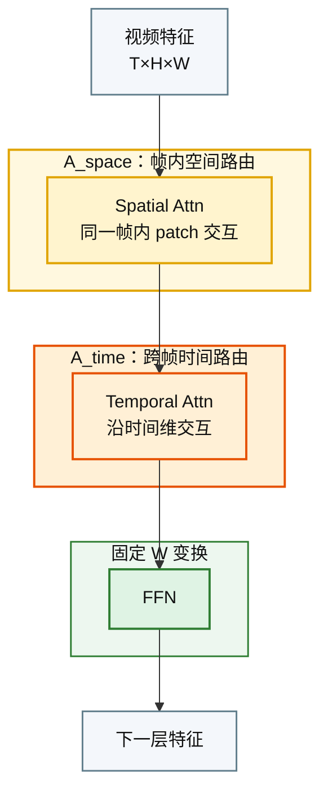

| | 分离式时空注意力 |
|---|---|
| **W** | 空间 Attention W + 时间 Attention W + FFN W（每层三套） |
| **A** | **双层 A！** A_space（空间路由）+ A_time（时间路由）。各自独立计算，各自有 QKV 投影 |
| **列数** | H 头（每层每 A 独立） |
| **时间路由** | 常见做法是先做空间注意力，再加 temporal attention / temporal module；具体是同位置还是更大窗口，取决于模型 |
| **代价** | 分解时空注意力省计算，也给时间结构加先验；代价是时空交互不如全注意力直接 |
| **洞察** | 这不是「落后形态」，而是计算量、数据量、结构先验之间的工程取舍 |

---

### 四、Video Understanding（视频理解）

**代表**：Video-LLaVA、LLaVA-NeXT-Video、InternVideo2

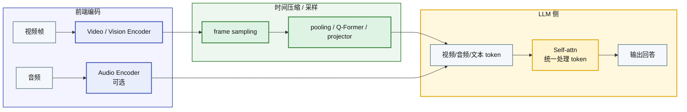

| | Video Understanding |
|---|---|
| **W** | 通常包括视频/视觉编码器、采样或压缩模块、投影器、LLM；不同模型差异很大 |
| **A** | 进入 LLM 后仍由 self-attn 处理视觉/视频 token；但前端视频编码器本身也可能有自己的时空 attention |
| **时间路由** | 不能笼统写成「A 侧不管时间」。有些模型先压缩时间，有些模型保留较多帧 token，有些模型用专门视频 encoder |
| **洞察** | 更稳的判断：视频理解的关键瓶颈之一是 token budget 和时间信息保留，不只是 W 或 A 单边问题 |

---

### 视频模型的 W/A 对比

| | Sora/DiT | CogVideoX | 分离式时空 | Video-LLaVA |
|---|---|---|---|---|
| **时间处理** | 高层上 token 化时间 | 3D attention + 3D RoPE | 空间/时间分解 | 编码器/采样/投影多种方案 |
| **A 形态** | Sora 细节未公开；DiT 类可分析 | full attention 可分析 | A_space + A_time | LLM A + 前端视频 A 可并存 |
| **W 侧时间** | latent/spacetime patch 化 | 3D VAE + 3D RoPE | temporal module 参数 | 视频 encoder / projector |
| **时空混合** | 公开资料不足以细判 | 较直接 | 分解后逐层融合 | 受 token budget 影响大 |
| **演化位** | 统一 patch 化路线 | 公开细节更完整的 DiT 视频例子 | 结构先验路线 | 多模态接入路线 |

---

### 核心洞察：时间可以 token 化，但不是必然被同一种 A 处理

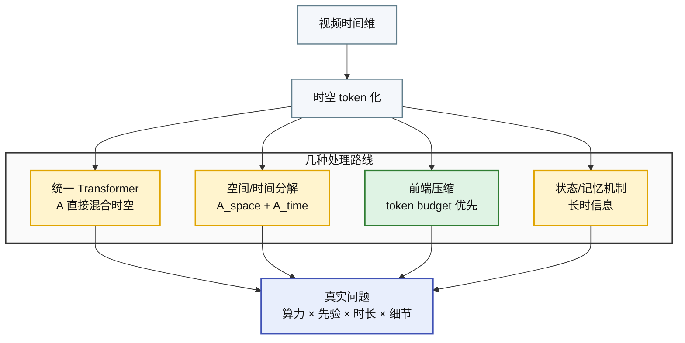

**视频模型没有单线演化成「统一 A 必胜」。** 更真实的格局是：全注意力、分离式时空注意力、状态空间/线性注意力、视频 encoder 压缩，都在按算力和任务目标竞争。

**W/A 框架的预测（降级版）**：如果 token budget 足够、位置/时间编码足够好，统一 attention 能承担相当多时空匹配；但长视频、长时一致性、运动细节，仍可能需要显式时间结构或压缩/记忆机制。

---

## 附录：LoRA 的 W/A 分析

> LoRA 里也有一个 A 和 B。和我们框架的 W/A 有什么关系？

### LoRA 干了什么

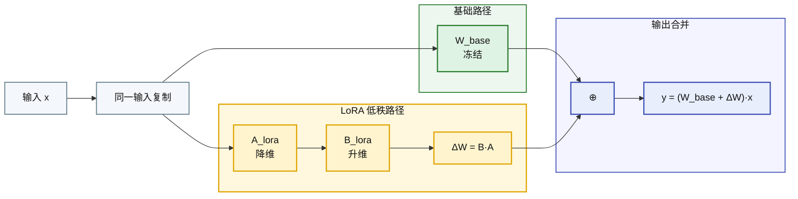

| | LoRA |
|---|---|
| **W 的变化** | W_base 冻结。B·A 新增，训练后**合并进 W_base**（或保持分离） |
| **A 的变化** | **零影响。** LoRA 不碰 attention 的 softmax 计算。路由行为完全由 W_base 的 QKV 投影决定 |
| **推理时** | B·A 合并入 W → 推理时是纯 W（比原来多了低秩修正） |
| **多 LoRA 切换** | 不同任务加载不同 B·A → W 有了「任务条件性」，但 A 仍然不参与适配 |

**W/A 诊断**：LoRA = **纯 W 侧的参数高效微调**。命名里的 A 和 B（低秩矩阵）是我们框架的 W。和我们框架的 A（动态路由）完全无关。

---

### 为什么 LoRA 常被加在 attention 投影上？

LoRA 原文的实验里，适配 attention 投影（尤其 Q/V）是常见且有效的配置。但这不是通用定律：不同任务、模型、rank、数据规模下，Q/K/V/O/FFN 的收益排序会变。

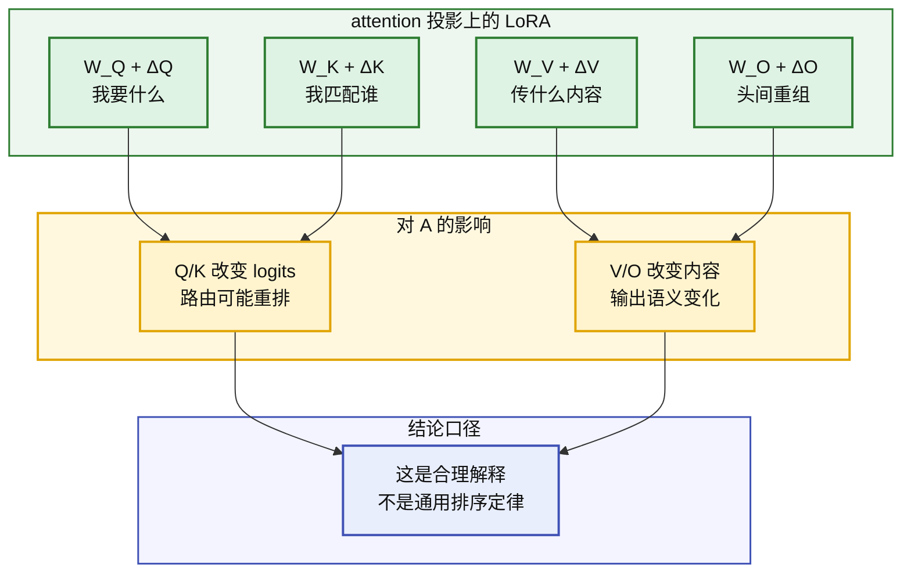

**W_Q / W_K / W_V 是 W 和 A 的交界面。** W_Q 或 W_K 变化会改变 attention logits，从而改变路由；W_V 变化主要改变被路由的信息内容；W_O 改变多头输出的重组方式。LoRA 高效的一个合理解释是：小的 W 改动可能通过 attention 影响大量 token-token 交互，但这仍是解释，不是严格证明。

---

### 在本架构中怎么用

```mermaid
flowchart LR
    accTitle: Column Specific LoRA Hypothesis
    accDescr: In the proposed persistent-column architecture, LoRA rank could be allocated independently per column and tested with ablation.

    subgraph COLUMNS["每列独立 LoRA"]
        direction TB
        c1["列₁<br/>W_Q¹ + ΔQ¹"]
        c2["列₂<br/>W_Q² + ΔQ²"]
        c3["列₃<br/>W_Q³ + ΔQ³"]
    end
    
    subgraph RANKS["可测设计"]
        direction TB
        b1["不同列不同 rank"]
        b2["功能列高 rank<br/>辅助列低 rank"]
        b3["分开消融<br/>Q/K/V/O/FFN"]
    end
    
    subgraph TEST["实验判断"]
        result["看 loss / 能力 / 路由图<br/>不要预设排序"]
    end

    COLUMNS --> RANKS --> TEST

    classDef column fill:#fff4ce,stroke:#e0a400,stroke-width:2px,color:#111
    classDef design fill:#dff3e4,stroke:#2e7d32,stroke-width:2px,color:#111
    classDef output fill:#e8eefc,stroke:#3f51b5,stroke-width:2px,color:#111

    style COLUMNS fill:#fff8df,stroke:#e0a400,stroke-width:2px,color:#111
    style RANKS fill:#edf7ef,stroke:#2e7d32,stroke-width:1.5px,color:#111
    style TEST fill:#f3f4ff,stroke:#3f51b5,stroke-width:1.5px,color:#111

    class c1,c2,c3 column
    class b1,b2,b3 design
    class result output
```

- 每列独立微调 → W 的列特异性在微调阶段保留
- A（列间路由）不动 → 微调只调语义不调路由模式
- 可以在预训练阶段就用不同 rank 初始化不同列
- 如果列之间参数独立，LoRA rank 可以按列分配；这是一种可测的工程设计，不是现成结论

**W/A 框架的预测（待验证）**：在本架构上，attention 投影 LoRA 和 FFN LoRA 应该分开做消融。更合理的实验问题不是预设排序，而是比较：改 Q/K 会不会主要改变路由，改 V/O/FFN 会不会主要改变内容表达。

---

## 附录：Seedance 的 W/A 分析（公开信息层面）

> Seedance 相关公开资料支持「原生视频 / 音视频生成」和「跨模态联合建模」这个大方向，但不足以支撑原文里那些具体 block 级断言。

### 公开事实和可解释部分

```mermaid
flowchart TB
    accTitle: Seedance Evidence Levels
    accDescr: Public Seedance materials support multimodal generation and cross-modal modeling, while detailed block frequency and exact branch wiring remain unsupported in public sources

    subgraph facts ["原文 / 官方资料可支撑"]
        seedance_1["Seedance 1.0<br/>视频生成模型"]
        seedance_15["Seedance 1.5 Pro<br/>音视频联合方向"]
        seedance_2["Seedance 2.0<br/>原生多模态生成"]
    end

    subgraph interpretation ["W/A 可解释"]
        branches["视觉 / 音频可视为分支"]
        bridge["跨模态模块可视为 A_cross"]
        coupling["音画同步来自联合建模"]
    end

    subgraph unsupported ["不写成事实"]
        every_four["每 4 层桥接一次"]
        exact_wo["W_O 全连接细节"]
        only_change["唯一结构变化"]
    end

    seedance_15 --> branches --> bridge --> coupling
    seedance_2 --> coupling
    every_four -.-> bridge
    exact_wo -.-> bridge
    only_change -.-> coupling

    classDef fact fill:#dff3e4,stroke:#2e7d32,stroke-width:2px,color:#111
    classDef explain fill:#fff4ce,stroke:#e0a400,stroke-width:2px,color:#111
    classDef danger fill:#fee2e2,stroke:#dc2626,stroke-width:2px,color:#7f1d1d

    style facts fill:#edf7ef,stroke:#2e7d32,stroke-width:1.5px,color:#111
    style interpretation fill:#fff8df,stroke:#e0a400,stroke-width:2px,color:#111
    style unsupported fill:#fff5f5,stroke:#dc2626,stroke-width:1.5px,color:#111

    class seedance_1,seedance_15,seedance_2 fact
    class branches,bridge,coupling explain
    class every_four,exact_wo,only_change danger
```

---

| | Seedance |
|---|---|
| **W** | 可讨论视频/音频相关模块和跨模态模块的固定参数，但公开资料不足以精确拆到每个 block |
| **A** | 如果公开资料提到 cross-modal joint / cross-modal interaction，可以解释为跨模态动态交互；但不要断言具体 Q_vis→K_aud 的层级实现 |
| **列/分支** | 可以类比成「模态绑定分支」，但不能直接等同为本架构的 N 列功能分化 |
| **删掉的断言** | 「每 4 层桥接一次」「Seedance = 本架构 N=2 特例」「唯一结构变化导致音画同步」 |
| **保留的洞察** | 音视频生成确实强调跨模态耦合；这支持「跨模态协调机制很重要」这个弱结论 |

---

### 和本架构的关系

| | Seedance | 本架构 | 关系 |
|---|---|---|---|
| **分支来源** | 模态预定义 | 功能列可能涌现 | 只能类比，不能等同 |
| **跨分支协调** | 公开资料支持跨模态联合建模 | 设计上显式跨列 A / W_O | 方向相似，细节不同 |
| **证据强度** | 公开资料有限 | 待实验验证 | 不能互相证明 |

**W/A 诊断**：Seedance 可以作为「多分支 + 跨模态协调」的参考案例，但不是本架构的直接证据。它最多支持一个温和判断：当任务需要强同步时，单纯后处理或弱拼接往往不够，模型内部需要某种跨模态耦合。

---

## 附录：Qwen3-Next 的 W/A 分析

> Qwen3-Next 的 hybrid attention 可以解释为「便宜动态机制 + 精细 attention」按层交替。它和 Seedance 都有“稀疏插入强交互模块”的味道，但不是同构结构。

### Hybrid Attention 的行间 W/A 结构

**12 × [3 × (DeltaNet → MoE) → 1 × (GatedAttention → MoE)]**

```mermaid
flowchart TB
    accTitle: Qwen3 Next Hybrid Blocks
    accDescr: Qwen3-Next repeats three Gated DeltaNet blocks followed by one Gated Attention block, with MoE layers after each dynamic block type

    subgraph CYCLE1["重复单元 1：3×DeltaNet + 1×Attention"]
        direction LR
        d1["S_d"] --> m1["MoE"]
        m1 --> d2["S_d"]
        d2 --> m2["MoE"]
        m2 --> d3["S_d"]
        d3 --> m3["MoE"]
        m3 --> ga1["S_a"]
        ga1 --> m4["MoE"]
    end

    subgraph CYCLE2["重复单元 2：同样节奏"]
        direction LR
        d5["S_d"] --> m5["MoE"]
        m5 --> d6["S_d"]
        d6 --> m6["MoE"]
        m6 --> d7["S_d"]
        d7 --> m7["MoE"]
        m7 --> ga2["S_a"]
        ga2 --> m8["MoE"]
    end

    m4 --> d5

    subgraph LEGEND["W/A 读法"]
        cheap["S_d：便宜动态机制"]
        precise["S_a：精细 QK 路由"]
        moe["MoE：稀疏 FFN W"]
    end

    CYCLE1 -.-> LEGEND

    classDef cheap_a fill:#fff4ce,stroke:#e0a400,stroke-width:2px,color:#111
    classDef precise_a fill:#fff0d6,stroke:#e65100,stroke-width:2px,color:#111
    classDef moe_w fill:#dff3e4,stroke:#2e7d32,stroke-width:2px,color:#111
    classDef note fill:#f4f7fb,stroke:#607d8b,stroke-width:1.5px,color:#111

    style CYCLE1 fill:#fafafa,stroke:#333,stroke-width:2px,color:#111
    style CYCLE2 fill:#fafafa,stroke:#333,stroke-width:2px,color:#111
    style LEGEND fill:#ffffff,stroke:#999,stroke-dasharray:4 3,color:#111

    class d1,d2,d3,d5,d6,d7 cheap_a
    class ga1,ga2 precise_a
    class m1,m2,m3,m4,m5,m6,m7,m8 moe_w
    class cheap,precise,moe note
```

**S_d**（黄）= Gated DeltaNet，线性 / 状态更新型动态机制。**S_a**（橙）= Gated Attention，QK attention + GQA。
**MoE**（绿）= 每个 block 后的稀疏 FFN 结构，512 个 routed experts，每 token 激活 10 个 routed experts，另有 1 个 shared expert。
**连线隐式**——block 输出直通下一个 S。

**节奏**：3 个 S_d → 1 个 S_a → 3 个 S_d → 1 个 S_a → ...。一组重复单元 = 4 blocks × 12 组 = 48 层。

| | Qwen3-Next |
|---|---|
| **W** | DeltaNet / GatedAttention 参数 + MoE 参数。MoE 是同一类 FFN 结构，不代表所有层共享同一套具体专家参数 |
| **A** | **两种动态机制交替。** Gated DeltaNet 更偏线性/状态更新，Gated Attention 更偏完整 QK 路由。Block 1-3 = DeltaNet，Block 4 = Gated Attention |
| **列数** | GatedAttn：16 Q-heads, 2 KV-heads（GQA）。DeltaNet：32 V-heads, 16 QK-heads。**不同 A 类型有不同的列配置** |
| **交替节奏** | 12 × [3×DeltaNet → 1×GatedAttn]。3:1 是公开模型卡可支撑的事实 |

**W/A 诊断**：Qwen3-Next 的交替 pattern 不是在模态间切换，而是在效率和精细路由之间切换。DeltaNet 处理大部分层，Gated Attention 周期性插入做更强的 token-token 交互。

**和本架构的关系**：它支持「不同动态机制可以按层组合」这个设计思路；但它不是列持久架构，也不能当作“多列独立 W”的证据。

---

## 附录：LinMU M-MATE 的 W/A 分析

> 双分支 block + 学习门控融合。两个分支各有独立 A，通过门控 W 融合。

```mermaid
flowchart LR
    accTitle: LinMU Dual Branch Fusion
    accDescr: LinMU M-MATE processes the same input through a global Flex-MA branch and local Swin branch, then combines them through a learned fusion path

    x["输入"] --> split["同一输入分两路"]

    subgraph GLOBAL["全局分支"]
        flex["Flex-MA<br/>Mamba-2 全局上下文<br/>A_linear"]
    end

    subgraph LOCAL["局部分支"]
        swin["Local-Swin<br/>窗口自注意力<br/>A_window"]
    end

    subgraph FUSION["融合"]
        gate["学习门控 α_i"]
        out["融合输出"]
    end

    split --> flex --> gate
    split --> swin --> gate
    gate --> out

    classDef input fill:#f4f7fb,stroke:#607d8b,stroke-width:1.5px,color:#111
    classDef global_a fill:#fff4ce,stroke:#e0a400,stroke-width:2px,color:#111
    classDef local_a fill:#fff0d6,stroke:#e65100,stroke-width:2px,color:#111
    classDef fusion fill:#dff3e4,stroke:#2e7d32,stroke-width:2px,color:#111

    style GLOBAL fill:#fff8df,stroke:#e0a400,stroke-width:2px,color:#111
    style LOCAL fill:#fff0d6,stroke:#e65100,stroke-width:2px,color:#111
    style FUSION fill:#edf7ef,stroke:#2e7d32,stroke-width:1.5px,color:#111

    class x,split input
    class flex global_a
    class swin local_a
    class gate,out fusion
```

| | LinMU M-MATE |
|---|---|
| **W** | Flex-MA W（Mamba 参数）+ Swin W（窗口 Attn 参数）+ 门控 α（可学习权重）。**双分支 W 独立** |
| **A** | **双 A 并行（非交替）！** 同一层内两条 A 同时运行——Flex-MA 做全局路由，Swin 做局部路由 |
| **列数** | 2 分支（功能分化：全局 vs 局部）。非模态绑定 |
| **融合** | 学习门控 / 权重融合更接近 W 侧融合；如果具体实现含输入依赖门控，则可再标成动态融合 |
| **演化位** | **最接近"功能列"概念的架构。** 两列做的事不同但共享输入。W 独立 + A 并行 |

**W/A 诊断**：LinMU 比 Seedance 更适合作为「功能分支」参考，因为它的两条分支按全局/局部分工，而不是按模态绑定。区别是它主要靠融合权重把两支合回来，不是公开的 cross-attn 跨分支路由。

---

## 附录：EchoMotion 的 W/A 分析

> 视频+动作双分支 DiT。MVS-RoPE 同步两个分支的位置编码。

```mermaid
flowchart LR
    accTitle: EchoMotion Modality Alignment
    accDescr: EchoMotion can be read as aligning video and action tokens through synchronized positional encoding before joint DiT interaction.

    subgraph VIDEO["视频侧"]
        video["视频 token"]
        v_pos["MVS-RoPE<br/>视频时间坐标"]
    end

    subgraph ACTION["动作侧"]
        action["动作 token"]
        a_pos["MVS-RoPE<br/>动作时间坐标"]
    end

    subgraph JOINT["联合 DiT"]
        concat["token 拼接 / 对齐"]
        dit["DiT attention<br/>联合交互"]
        out["生成视频"]
    end

    video --> v_pos --> concat
    action --> a_pos --> concat
    concat --> dit --> out

    classDef token fill:#f4f7fb,stroke:#607d8b,stroke-width:1.5px,color:#111
    classDef position fill:#e8eefc,stroke:#3f51b5,stroke-width:2px,color:#111
    classDef dynamic fill:#fff4ce,stroke:#e0a400,stroke-width:2px,color:#111
    classDef output fill:#dff3e4,stroke:#2e7d32,stroke-width:2px,color:#111

    style VIDEO fill:#f3f4ff,stroke:#3f51b5,stroke-width:1.5px,color:#111
    style ACTION fill:#f3f4ff,stroke:#3f51b5,stroke-width:1.5px,color:#111
    style JOINT fill:#fff8df,stroke:#e0a400,stroke-width:2px,color:#111

    class video,action,concat token
    class v_pos,a_pos position
    class dit dynamic
    class out output
```

| | EchoMotion |
|---|---|
| **W** | 视频分支 W + 动作分支 W + MVS-RoPE（同步的时间位置编码） |
| **A** | 双模态 token / 分支进入 DiT 后仍可能通过 attention 交互；不能简单写成「跨列同步不走 A」 |
| **列数** | 2（视频+动作。模态绑定） |
| **同步机制** | MVS-RoPE 是重要的位置对齐机制，可解释为 W 侧给 A 提供同步坐标系 |
| **演化位** | 它提示：跨模态协调不只靠 cross-attn，也可以靠位置编码、token 拼接和联合 DiT 共同完成 |

**W/A 诊断**：EchoMotion 给了另一种跨模态协调线索：位置编码可以先把不同模态放到同一时间坐标里，再让 DiT 去做交互。这里不要把 W/A 分得太绝对。

---

## 多分支架构的统一 W/A 对比

| | Seedance | Qwen3-Next | LinMU | EchoMotion | 本架构 |
|---|---|---|---|---|---|
| **结构类型** | 跨模态联合建模 | 按层 hybrid block | 双分支并行 | 动作/视频联合 DiT | N 列持久 |
| **分支/列含义** | 模态相关 | 不是持久列，是 block 类型 | 功能分支（全局/局部） | 模态/条件相关 | 功能列假说 |
| **W 独立性** | 公开细节不足 | 各层/模块有各自参数 | Flex/Swin 分支不同 | 公开细节需谨慎 | 设计上列独立 |
| **多 A 类型** | 可能有跨模态交互 | DeltaNet + GatedAttn | Flex-MA + window attn | DiT attention + MVS-RoPE 坐标 | 可选 |
| **协调机制** | 跨模态联合模块 | 周期性强 attention | 融合权重 | 位置编码 + 联合 DiT | 显式跨列交互 |
| **可借鉴点** | 强同步需要内部耦合 | 稀疏插入强交互 | 功能分支有价值 | 坐标对齐很重要 | 待实验验证 |

---

## 完整演化树（更新）

```mermaid
flowchart TD
    accTitle: Architecture Inspiration Map
    accDescr: The updated map shows mainstream architectures as inspiration paths rather than proof that they converge to the proposed persistent-column architecture

    MLP["MLP"] --> RNN["RNN"] --> LSTM["LSTM"]
    MLP --> CNN["CNN"]
    
    LSTM --> BAHD["Bahdanau"] --> TF["Transformer"]
    CNN --> TF
    
    TF --> MAMBA["Mamba/S4"]
    TF --> QWEN["Qwen3-Next\nhybrid block\n效率/精度取舍"]
    TF --> SEED["Seedance\n跨模态联合建模"]
    TF --> LINMU["LinMU M-MATE\n功能双分支"]
    TF --> ECHO["EchoMotion\n位置对齐 + 联合 DiT"]
    
    QWEN -.->|设计启发| US["本架构\nN 列持久 + 独立W + 跨列A"]
    SEED -.->|设计启发| US
    LINMU -.->|设计启发| US
    ECHO -.->|设计启发| US

    classDef baseline fill:#fee2e2,stroke:#dc2626,stroke-width:2px,color:#7f1d1d
    classDef dynamic fill:#fef9c3,stroke:#ca8a04,stroke-width:2px,color:#713f12
    classDef transformer fill:#dcfce7,stroke:#16a34a,stroke-width:2px,color:#14532d
    classDef inspiration fill:#ffedd5,stroke:#ea580c,stroke-width:2px,color:#7c2d12
    classDef proposal fill:#dbeafe,stroke:#2563eb,stroke-width:3px,color:#1e3a5f

    class MLP,RNN,CNN baseline
    class LSTM,BAHD dynamic
    class TF,MAMBA transformer
    class QWEN,SEED,LINMU,ECHO inspiration
    class US proposal
```

**更稳的结论**：这些架构不是“全都收敛到本架构”，而是暴露出类似的设计压力：长上下文要省算力，多模态要同步，长视频要保时间，局部/全局信息要分工。本架构可以把这些压力统一成一个研究假说，但还需要消融实验证明。

---

## 主要来源

- Transformer: https://arxiv.org/abs/1706.03762
- Bahdanau Attention: https://arxiv.org/abs/1409.0473
- Mamba: https://arxiv.org/abs/2312.00752
- LLaVA: https://arxiv.org/abs/2304.08485
- Flamingo: https://arxiv.org/abs/2204.14198
- CogVLM: https://arxiv.org/abs/2311.03079
- GPT-4o: https://openai.com/index/hello-gpt-4o/
- GPT-4o System Card: https://openai.com/index/gpt-4o-system-card/
- Gemini: https://arxiv.org/abs/2312.11805
- Gemini 1.5: https://arxiv.org/abs/2403.05530
- Sora technical report: https://openai.com/index/video-generation-models-as-world-simulators/
- DiT: https://arxiv.org/abs/2212.09748
- CogVideoX: https://arxiv.org/abs/2408.06072
- VideoLDM: https://arxiv.org/abs/2304.08818
- Video-LLaVA: https://arxiv.org/abs/2311.10122
- LoRA: https://arxiv.org/abs/2106.09685
- Seedance 1.0: https://arxiv.org/abs/2506.09113
- Seedance 1.5 Pro: https://arxiv.org/abs/2512.13507
- Seedance 2.0: https://arxiv.org/abs/2604.14148
- Qwen3-Next model card: https://huggingface.co/Qwen/Qwen3-Next-80B-A3B-Instruct
- LinMU M-MATE: https://arxiv.org/abs/2601.01322
- EchoMotion: https://arxiv.org/abs/2512.18814
